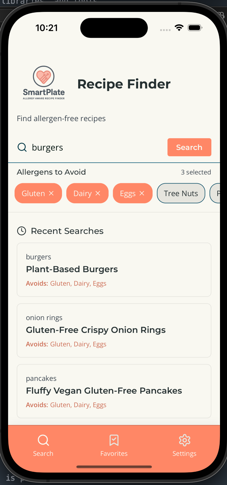
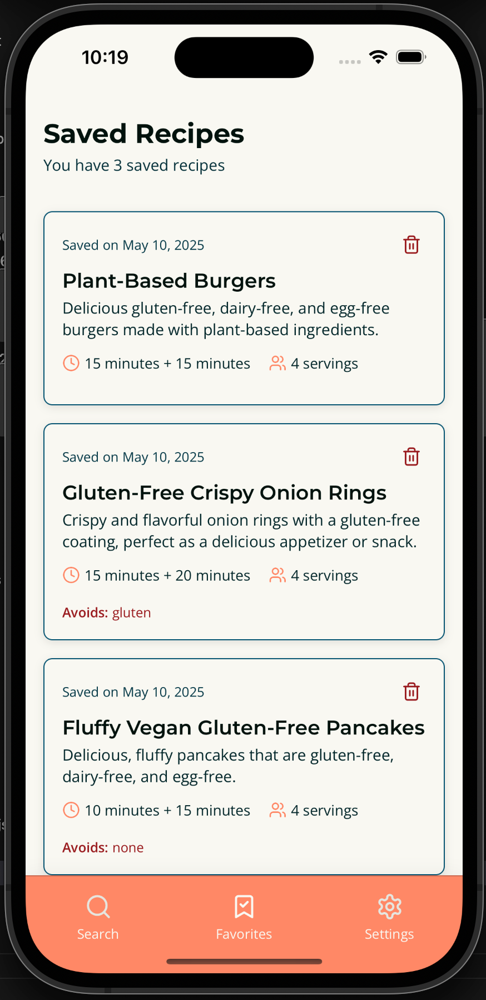
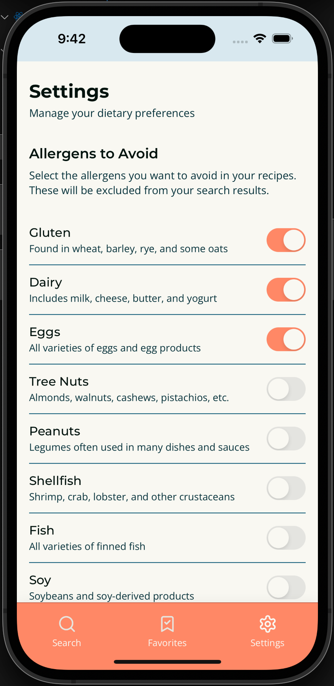

# 🥗 SafePlate – Allergy & Diet-Aware Recipe Finder

SafePlate is a mobile app built with React Native and Expo that helps users discover recipes tailored to their allergies and dietary preferences. Users can save their preferences, browse AI-powered suggestions, and mark recipes as favorites for easy access — all backed by a Supabase-powered backend.

---

## 🚀 Features

- 🔍 **Search allergy-safe & diet-friendly recipes**
- 🧠 **AI-enhanced recipe suggestions**
- 💾 **Save dietary preferences**
- ❤️ **Mark & view favorite recipes**
- 🔐 **User authentication with Supabase**
- 📱 **Cross-platform support (iOS & Android via Expo)**

---

## 🧱 Built With

- [React Native](https://reactnative.dev/)
- [Expo](https://expo.dev/)
- [Supabase](https://supabase.io/)
- [OpenAI API](https://platform.openai.com/)

---

## 📸 Screenshots

| Search                                 | Favorites                                    | Settings                                   |
| -------------------------------------- | -------------------------------------------- | ------------------------------------------ |
|  |  |  |

---

## 📦 Getting Started

### 1. Clone the repo

```bash
git clone https://github.com/your-username/safeplate.git
cd safeplate
```
